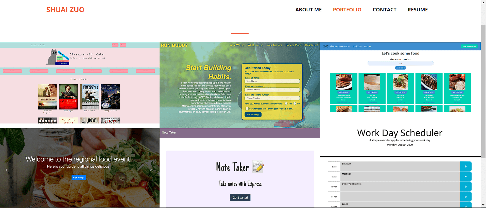

# React Portfolio

## 💡💡💡Finished work

* [The Link of the deployed application.](http://zwind66.github.io/react-portfolio/)

* [The Link of the GitHub repository.](https://github.com/zwind66/react-portfolio)

## Description

A portfolio site using React.js Single Page Application to showcase the projects that I have done in this bootcamp..

## User Story

    AS AN employer looking for candidates with experience building single-page applications
    I WANT to view a potential employee's deployed React portfolio of work samples
    SO THAT I can assess whether they're a good candidate for an open position      

## Table of Contents

- [Description](#description)
- [User Story](#user-story)
- [Installation](#installation)
- [Usage](#usage)
- [License](#license)
- [Contributing](#contributing)
- [Tests](#tests)
- [Questions](#questions)

## Installation

The user should clone the repository from GitHub and download Node. This application also requires  and inquirer module.

`git clone`   `npm i`   `npm start`

## Usage

* Clone this repository to use this application on local machine:

`git clone`

* To install necessary dependencies, run the following command :

`npm i`

* The application will be invoked with the following command: This will start localhost server on PORT 3001.

`npm start`

## License

This application is covered by the MIT license.

## Contributing

Shuai Zuo ©2022 All Rights Reserved.

## Tests

Run `npm test` to run Jest tests when there is an test

## Questions

Find me on GitHub: [zwind66](https://github.com/zwind66)

Email me with any questions: szuo1@vols.utk.edu

This README file was generated by [README-generator](<https://github.com/zwind66/README-generator>）